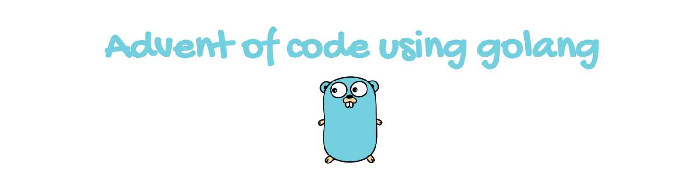

# Advent of Code 2024

[▶ THE WHY](https://www.youtube.com/watch?v=wf48XDnXtKI)

Following the example of Prime, I'm going to try to learn golang this year. We'll see how far I get.

https://adventofcode.com

⚠ **Disclaimer:** I'm using this as an opportunity to learn the language! So, I'm not going to be following best practices or anything like that. Sorry for all the code smells!

2024 Scenario:

The *Chief Historian* is always present for the big Christmas sleigh launch, but nobody has seen him in months! Last anyone heard, he was visiting locations that are historically significant to the North Pole; a group of Senior Historians has asked you to accompany them as they check the places they think he was most likely to visit.

As each location is checked, they will mark it on their list with a **star**. They figure the Chief Historian *must* be in one of the **first fifty** places they'll look, so in order to save Christmas, you need to help them get **fifty stars** on their list before Santa takes off on December 25th.

Collect stars by solving puzzles. Two puzzles will be made available on each day in the Advent calendar; the second puzzle is unlocked when you complete the first. Each puzzle grants one star. Good luck!

## 💡 Solutions

[📆 Day 1](/solutions/day_1/)

---

Made with ❤️ by [Johandielangman](https://github.com/Johandielangman)